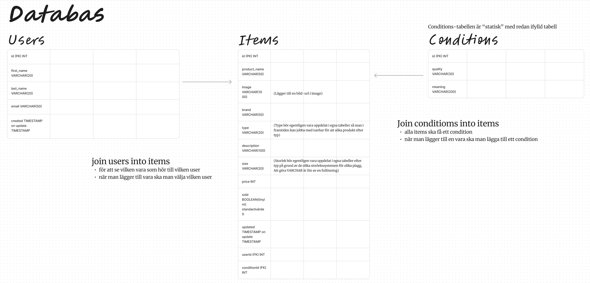

# secondsphere
Slutprojekt Systemutveckling PHP
Detta projekt är skapat i PHP med html-output, där jag har använt MyPhpAdmin som gränssnitt för att jobba mot min databas i mysql. 
Projektet är strukturerat med model-view-controler(MVC) där filerna i roten utgör controllers. Jag försöker jobba objek-orienterat(enligt OOP) med klasser och arv. Projektet inkluderar validering och sanering i input-fält från användaren samt typräkring i koden. 

Case:
En secondhandbutik NAMN behöver en webbtjänst för att hålla koll på sina plagg och vem som lämnat in dem. Detta är en sådan butik där en person (vi kallar dem säljare) kan lämna in kläder och butiken säljer dem, tar en viss del av försäljningen och en viss del går tillbaka till den som lämnar in kläderna (säljaren).

Uppgift:
Vi ska bygga en första prototyp för att illustrera några av de grundläggande funktionerna:
1. Lista säljare alfabetiskt 
2. Lista plagg 
3. Lägg till plagg 
4. Lägg till säljare (den som lämnade in plagget) 
5. Markera ett plagg som sålt 
6. Visa information om säljaren:
- antal inlämnade plagg 
- antal sålda plagg 
- totala försäljningssumman 
- alla plagg som säljaren lämnat in 

Denna webbtjänst ska vidareutvecklas så vi behöver tänka skalbart och designa en databas som kan hantera ytterligare funktioner i framtiden.
Framtida funktioner;
1. I listan med plagg se hur många dagar som plagget varit inlämnat CHECK
2. Visa logg på händelser i webbtjänsten med tid och datum för händelsen CHECK

Databasstruktur:

Relationer:
- Bgränsningnamn - user-item | userId | secondsphere | users | id
- Begränsningsnamn - condition-item | conditionsId | secondsphere | conditions | id

Bild url:er som används i koden:
- väska (används för att lägga upp på alla bilder): 
https://images.unsplash.com/photo-1598532163257-ae3c6b2524b6?ixlib=rb-4.0.3&ixid=M3wxMjA3fDB8MHxzZWFyY2h8OHx8aGFuZGJhZ3xlbnwwfHwwfHx8MA%3D%3D&auto=format&fit=crop&w=900&q=60
- Flera Jeans på galge (används som bakgrund i header och footer): 
https://images.unsplash.com/photo-1576995853123-5a10305d93c0?ixlib=rb-4.0.3&ixid=M3wxMjA3fDB8MHxzZWFyY2h8MTF8fHBhbnRzfGVufDB8fDB8fHww&auto=format&fit=crop&w=900&q=60